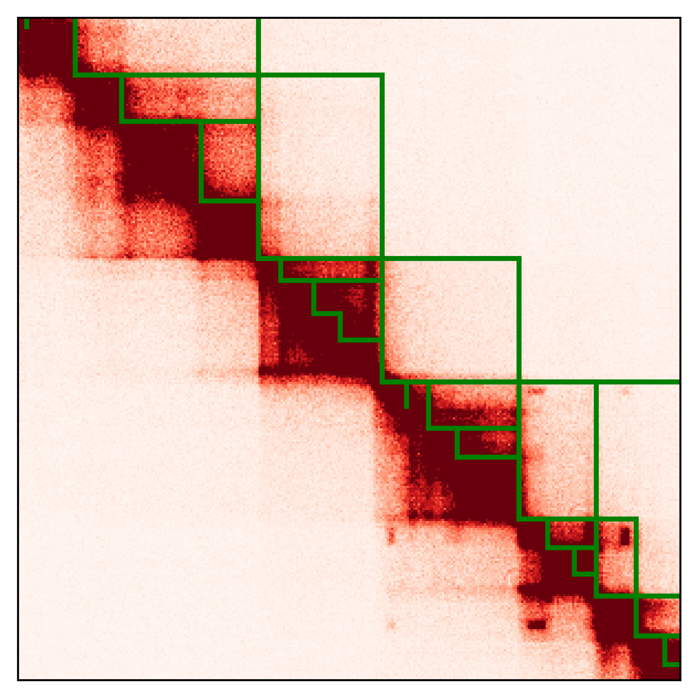

# README #

Plotting example using lib5c package

### How do I get set up? ###

sh setup_venv.sh

### Guidelines ###

### Step 1 ###
plotting example for domain calls on heatmap:

sh plot_domain.sh (run plot_domain.py)    

Prior to running this code raw Hi-C matrices should be balanced. Chromosome balanced sparse matrix is
used as input.   

#### input ####

heatmap = chromosome sparse matrix .npz in input_heatmaps directory     
domains = domain calls bed file in input_bed directory     
chromosome = chromosome of plot      
start = start coordinate of plot     
end = end coordinate of plot      
max_color = maximum color of plot     

#### Output ####
output placed in output/ subdirectory    
*{domains}*'_' + args.chr  + '_' + str(start)  + '_' + str(end) + '_' +  str(args.max_color) + '.png'

